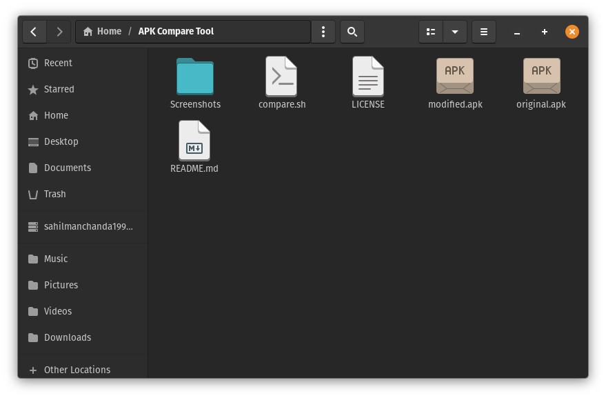
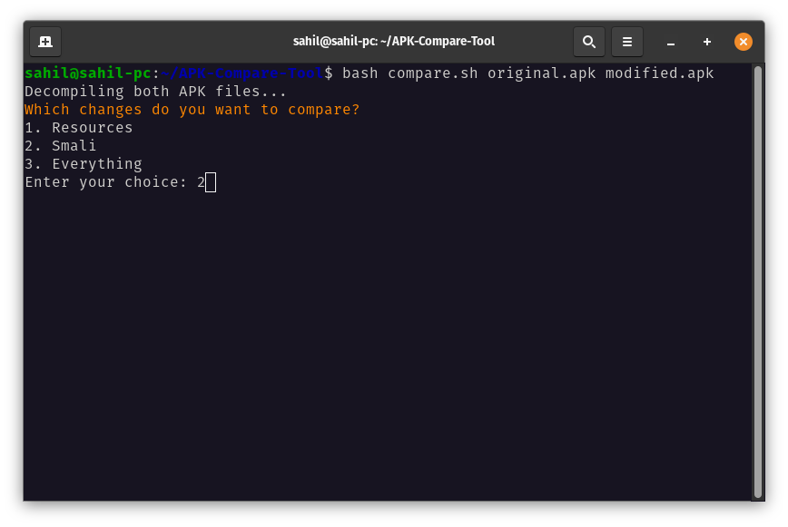
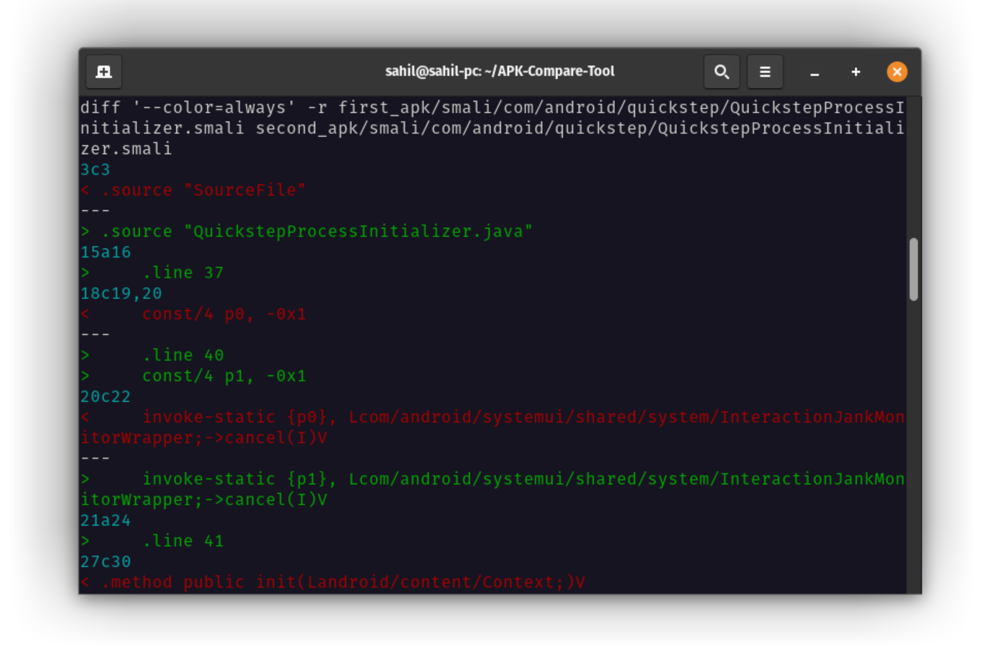
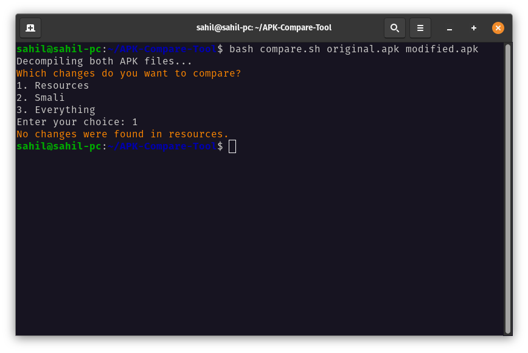

# APK Compare Tool

<div align="center">
    
</div>

APK Compare Tool is a bash script that allows developers to compare two APK files and identify the differences in their resources and smali code. The script uses apktool and diff tool to decompile and compare the APK files based on the user's input.
> The APK Compare Tool is a useful tool for developers who want to compare APK files and identify differences in resources and smali code. It is easy to use, flexible, and provides color-coded output for quick identification of changes.

### Key Points
- The script is designed to compare any two APK files, including comparison between original and modified versions or older and newer versions.
- Users can select which changes they want to compare, including resources, smali, or everything in the APK.
- The APK Compare Tool provides detailed comparison results, including the identification of files that are different, along with the line numbers where changes have occurred. Additionally, the tool shows what has been removed or added.
- The output is displayed with color-coded differences to make it easy for developers to identify changes quickly.

### Prerequisites
- To use the APK Compare Tool, users will need to install `Apktool` and `diff tool`. Make sure you have both of these tools in your system. Installing difftool on a Linux-based operating system is straightforward as it usually comes pre-installed. However, you'll need to install Apktool manually. If you're using Termux(F-Droid) then you can [clone this repository](https://github.com/rendiix/termux-apktool) & install apktool manually.

### Usage
- Clone the repo using git.
```sh
git clone https://github.com/saitamasahil/APK-Compare-Tool.git
```
- Navigate to the **APK-Compare-Tool** folder.
```sh
cd APK-Compare-Tool
```
- Keep your both apk files(which you want to compare) in **APK-Compare-Tool** folder.
- Now run the script:
```sh
bash compare.sh <name_of_first_apk> <name_of_second_apk>
```
> Note: Although the APK file names can be anything, it is recommended to use `original.apk` as the first APK and `modified.apk` as the second one when comparing original and modified versions. This makes it easier to identify changes, as the modified changes will be displayed in green color. Example of such input script can be: `bash compare.sh original.apk modified.apk`.
- If your current environment is other than bash then use following commands:
```sh
chmod +x compare.sh
./compare.sh <name_of_first_apk> <name_of_second_apk>
```

### Screenshots





**Brought to you by [saitamasahil](https://github.com/saitamasahil)!**