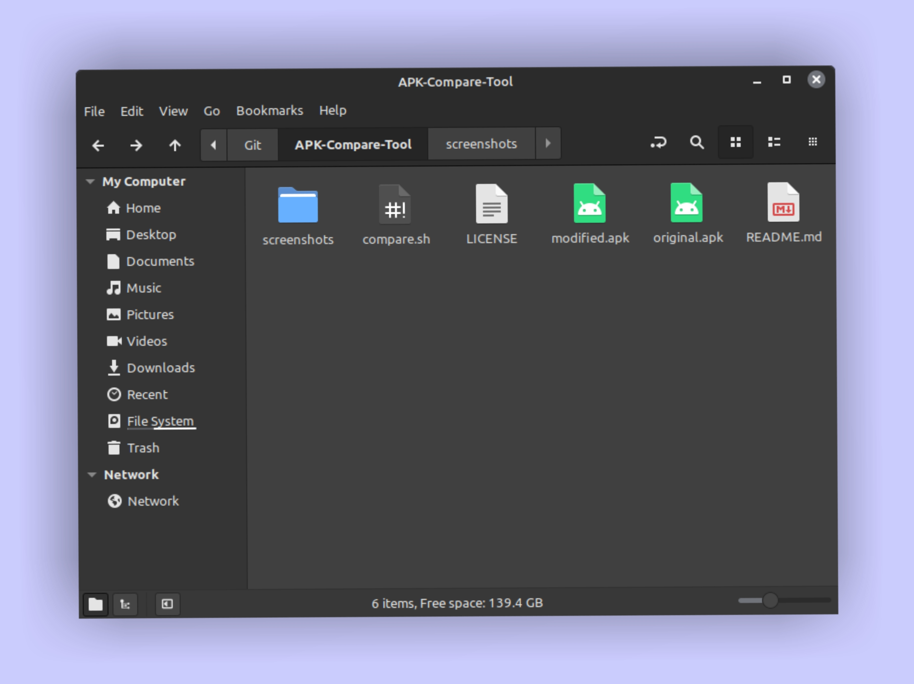
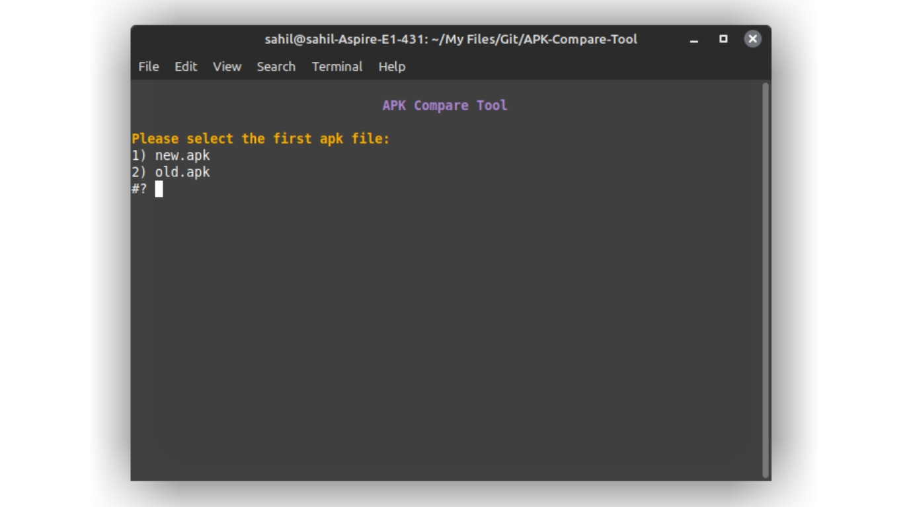
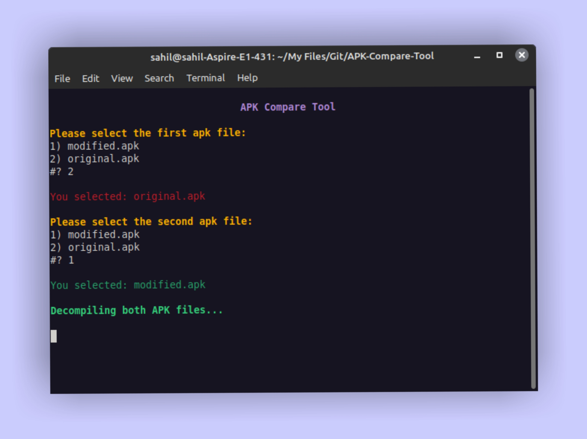
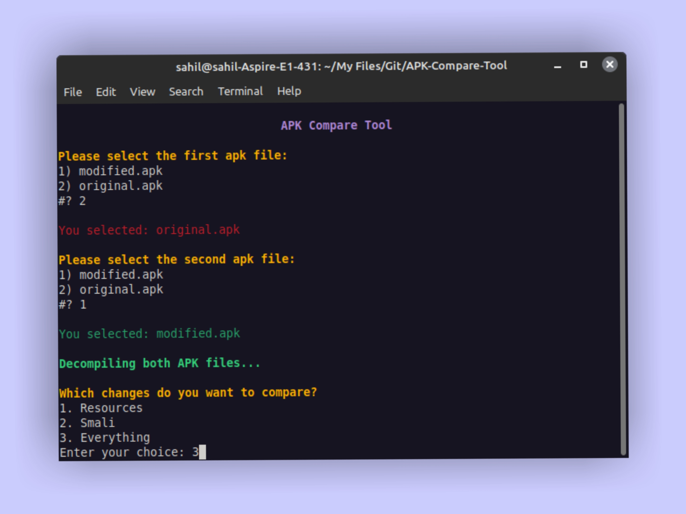
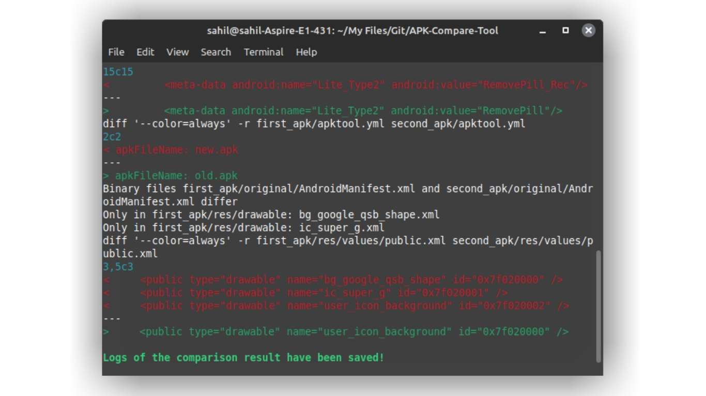
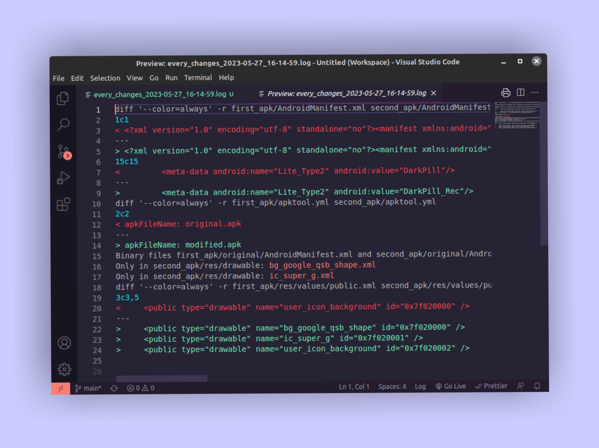

# APK Compare Tool

<div align="center">
    
</div>

APK Compare Tool is a shell script that allows developers to compare two APK files and identify the differences in their resources and smali code. The script uses apktool and diff tool to decompile and compare the APK files based on the user's input.
> The APK Compare Tool is a useful tool for developers who want to compare APK files and identify differences in resources and smali code. It is easy to use, flexible, and provides color-coded output for quick identification of changes.

### Key Points
- The script is designed to compare any two APK files, including comparison between original and modified versions or older and newer versions.
- Users can select which changes they want to compare, including resources, smali, or everything in the APK.
- The APK Compare Tool provides detailed comparison results, including the identification of files that are different, along with the line numbers where changes have occurred. Additionally, the tool shows what has been removed or added.
- The output is displayed with color-coded differences to make it easy for developers to identify changes quickly.
- The APK Compare Tool saves logs of the comparison results, which can be accessed later to view the changes between the APK files. This allows developers to keep a record of the changes made to the APK over time and can help in identifying and resolving issues.

### Prerequisites
- To use the APK Compare Tool, users will need to install `Apktool` and `diff tool`. Make sure you have both of these tools in your system. Installing difftool on a Linux-based operating system is straightforward as it usually comes pre-installed. However, you'll need to install Apktool manually. If you're using Termux(F-Droid) then you can [clone this repository](https://github.com/rendiix/termux-apktool) & install apktool manually.

### Usage
- Clone the repo using git.
```sh
git clone https://github.com/saitamasahil/APK-Compare-Tool.git
```
- Navigate to the **APK-Compare-Tool** folder.
```sh
cd APK-Compare-Tool
```
- Keep your both apk files(which you want to compare) in **APK-Compare-Tool** folder.
- Now run the script:
```sh
chmod +x compare.sh && ./compare.sh
```
- Now select first & second apk from the list shown in terminal.
- Now you can compare both apks.
> Note: If your terminal gives "Permission denied" error then run the tool by typing `bash compare.sh`.

### Read Saved Logs
The APK Compare Tool automatically saves logs of the comparison results whenever an APK comparison is performed. To view the logs in color-coded differences follow these instructions.

#### Terminal
To read saved logs in Terminal, Type `cat <name_of_log_file>`.

#### VS Code
To read saved logs in VS Code, [Download this extension](https://marketplace.visualstudio.com/items?itemName=iliazeus.vscode-ansi). Now open log file in VS Code, Press `Ctrl+Shift+P` to access **Command Palette**. Search **ANSI** in Command Palette. Select `ANSI Text: Open Preview`. This will open a preview page where you will be able to see changes in color-coded differences.

### Screenshots
<div align="center">
    
</div>
<div align="center">
    
</div>
<div align="center">
    
</div>
<div align="center">
    
</div>
<div align="center">
    
</div>
<div align="center">
    
</div>

**Brought to you by [saitamasahil](https://github.com/saitamasahil)!**